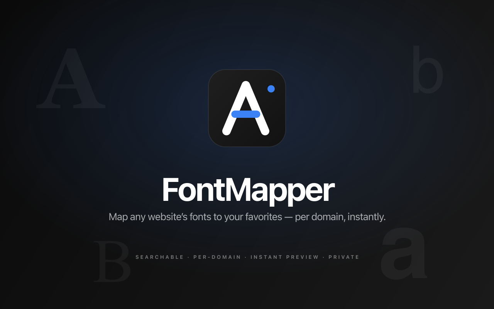
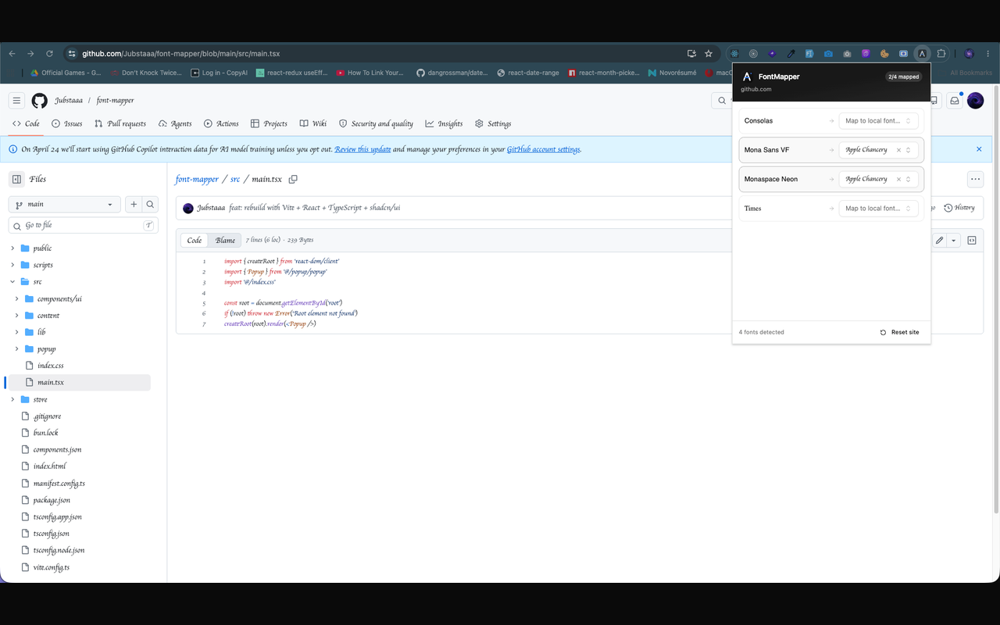

<div align="center">


# FontMapper

**Map any website's fonts to your local fonts — per domain, instantly.**

<p>
  <a href="https://chromewebstore.google.com/detail/gfdmhpidmomcbghfoejkcpjdklbdcdnn"></a>
  <a href="LICENSE"></a>
  <a href="https://github.com/Jubstaaa/font-mapper/stargazers"></a>
</p>

<p>
  <a href="https://chromewebstore.google.com/detail/gfdmhpidmomcbghfoejkcpjdklbdcdnn"></a>
</p>

</div>

<p align="center">
  
</p>

---

## What it does

FontMapper is a Chrome extension that lets you replace any website's fonts with your favorite local fonts. Open the popup on any page, see every font the site is using, swap each one for any font installed on your machine, and FontMapper remembers your choices — per domain, applied automatically on every visit.

Built for people who care about typography, accessibility, or just don't like how a particular site renders its body text.

## Features

- **Per-domain mapping** — different replacements for different sites, applied automatically
- **Searchable font picker** — type to filter through every font on your machine; each option previews in its own typeface
- **Hover to identify** — hover any detected font in the popup and every element using it gets highlighted on the page
- **Instant preview** — changes apply in real time, no reload
- **One-click reset** — wipe all mappings for a site
- **Zero data collection** — everything stays local, no network requests, no analytics, no accounts

<p align="center">
  
</p>

## How it works

Under the hood, FontMapper uses standard CSS `@font-face` with `local()` substitution:

```css
@font-face {
    font-family: 'Arial';
    src: local('Product Sans');
}
```

This tells the browser: "wherever Arial is requested, render it with Product Sans instead." Native, fast, layout-preserving.

Per-domain preferences are persisted via `chrome.storage.local` — never sent anywhere.

## Install

### From the Chrome Web Store

[**Install FontMapper from the Chrome Web Store →**](https://chromewebstore.google.com/detail/gfdmhpidmomcbghfoejkcpjdklbdcdnn)

One click, no setup. Works on any Chromium-based browser (Chrome, Edge, Brave, Arc).

### From source

```bash
git clone git@github.com:Jubstaaa/font-mapper.git
cd font-mapper
bun install
bun run build
```

Then in Chrome:

1. Open `chrome://extensions`
2. Enable **Developer mode** (top-right toggle)
3. Click **Load unpacked**
4. Select the `dist/` folder

## Development

```bash
bun install
bun run dev        # Vite dev server + HMR (dist/ auto-rebuilds)
bun run build      # Production build → dist/
bun run typecheck  # tsc -b --noEmit
```

## Tech stack

| Layer        | Tools                                                            |
| ------------ | ---------------------------------------------------------------- |
| Build        | Vite, [@crxjs/vite-plugin](https://crxjs.dev), Bun               |
| UI           | React 19, TypeScript, Tailwind CSS v4                            |
| Components   | shadcn/ui (new-york), Radix UI, cmdk, lucide-react               |
| Browser APIs | `chrome.storage`, `chrome.fontSettings`, `chrome.tabs`, MV3 ports |

## Project structure

```
src/
├── content/
│   └── content.ts            Font scanning, @font-face injection, hover highlighting
├── lib/
│   ├── chrome-storage.ts     Per-domain mapping persistence
│   ├── chrome-fonts.ts       Local font enumeration (chrome.fontSettings)
│   ├── chrome-messaging.ts   Type-safe popup ↔ content script messages
│   └── utils.ts              shadcn cn helper
├── popup/
│   ├── popup.tsx             Main React component
│   ├── font-mapping-row.tsx  Single row (source font → combobox)
│   └── font-combobox.tsx     Searchable combobox (cmdk + Radix Popover)
├── components/ui/            shadcn primitives
├── main.tsx                  React entry
└── index.css                 Tailwind + design tokens

public/                       Manifest icons (16/32/48/128)
store/                        Chrome Web Store assets (icon, screenshots)
```

## Privacy

FontMapper does not collect, transmit, or store any data outside of your browser's local storage. No analytics. No telemetry. No accounts. The full source is in this repo.

## License

MIT

---

<div align="center">

If FontMapper made your day a little better, [**leave a review on the Chrome Web Store**](https://chromewebstore.google.com/detail/gfdmhpidmomcbghfoejkcpjdklbdcdnn) or ⭐ this repo. It really helps.

</div>
